# Hello, I'm SpyArmy 👋

Just a guy who codes for fun.

---

### Languages

  
  
  
  
  

### Currently Learning

  
  
  

---

## 🚀 Projects

- Nothing public yet... coming soon.

---

## 📊 GitHub Stats

